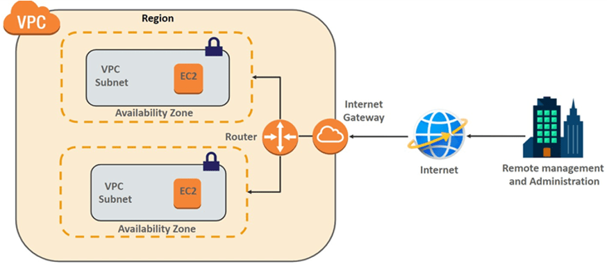
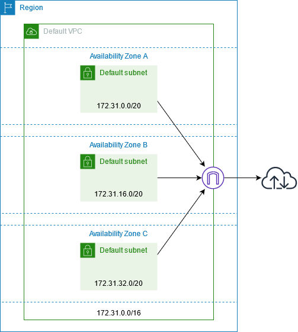
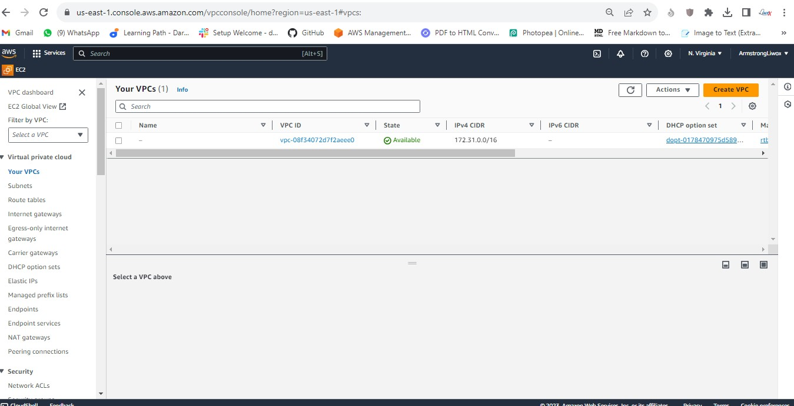

# AWS Networking implementation (VPC, Subnets, IG, NAT, Routing)

---

The objective of this course is to master the art of AWS networking implementation, including VPC, subnets, internet gateways, NAT, and routing, 

This project will enable me to design and deploy scalable and secure cloud architectures.

---
# STUDY NOTES
---

# AWS VPC Creation and Subnet Configuration

This field uses Virtual Private Clouds (VPCs) and subnets to create the backbone of our cloud-based projects. 

This course will simplify the complex aspects of AWS networking, highlighting the useful and adaptable nature of VPCs and subnets.

---

# What is an Amazon VPC?

A virtual private cloud (VPC) is a virtual network dedicated to your AWS account. 

It is logically isolated from other virtual networks in the AWS Cloud. 

You can specify an IP address range for the VPC, add subnets, add gateways, and associate security groups. A subnet is a range of IP addresses in your VPC.

An Amazon Virtual Private Cloud (VPC) is like your own private section of the Amazon cloud, where you can place and manage your resources (like servers or databases). You control who and what can go in and out, just like a gated community.

The essential steps to creating a VPC and configuring core network services. The topics to be covered are:

• The Default VPC

• Creating a new VPC

• Creating and configuring subnets

---

## The Default VPC

The Default VPC is like a starter pack provided by Amazon for your cloud resources. It's a pre-configured space in the Amazon cloud where you can immediately start deploying your applications or services. It has built-in security and network settings to help you get up and running quickly, but you can adjust these as you see fit.

When you start using Amazon VPC, you have a default VPC in each AWS Region. A default VPC comes with a public subnet in each Availability Zone, an internet gateway, and settings to enable DNS resolution. Therefore, you can immediately start launching Amazon EC2 instances into a default VPC.

---

---
## Creating a new VPC

- To create a new vpc choose the "VPC only" option, we'll use the "VPC and more" option later. 

- Enter "first-vpc" as the name tag and "10.0.0.0/16" as the IPv4 CIDR. 

- The "10.0.0.0/16" will be the primary IPv4 block and you can add a secondary IPv4 block e.g., "100.64.0.0/16". 

- The use case of secondary CIDR block could be because you're running out of IPs and need to add additional block, or there's a VPC with overlapping CIDR which you need to peer or connect. 

- See this blog post on how a secondary CIDR block is being used in an overlapping IP scenario: 

https://aws.amazon.com/blogs/networking-and-content-delivery/how-to-solve- private-ip-exhaustion-with-private-nat-solution/

- Leave the tags as default, you can add more tags if you want and click CREATE VPC

- As soon as the VPC is created, it's assigned with a vpc-id and there's a route table created that serves as the main route table - rtb-034f3b111e7c692bc in below example.

- Now you have a VPC and a route table, but you won't be able to put anything inside. If you try to create an EC2 instance for example, you can't proceed as it requires subnets. Creating and configuring subnets

---

# Creating and configuring subnets

## What are Subnets?

Subnets are like smaller segments within a VPC that help you organize and manage your resources. 

Subnets are like dividing an office building into smaller sections, where each section represents a department. 

In this analogy, subnets are created to organize and manage the network effectively.

---

